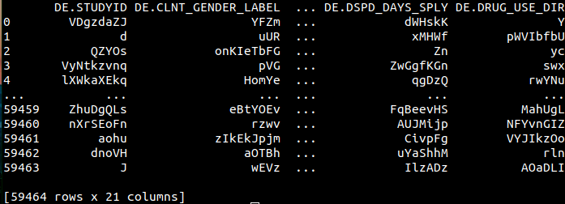
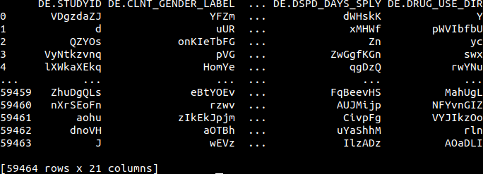

# fixedwidthtoparquet

Demonstration of converting:

A) **totally synthetic** fixed-width format data to:

B) parquet format

using C++ arrow interface. Tested on ubuntu linux

## files
**[dd_apply.cpp](cpp/dd_apply.cpp)**: convert fixedwidth to parquet (and csv simultaneously)

**[read_parquet.py](py/read_parquet.py)**: print out tibble from parquet file

**[read_csv.py](py/read_csv.py)**: print out tibble from csv file

## setup
```
sudo sh/setup_debian.sh
```

## run test: convert fixedwidth to parquet
```
./sh/test.sh
```
## read parquet from python
```
python3 py/read_parquet.py
```


## note
```
wc -l moh_dip_pharmanet_dsp.rpt.dat 
```
yields:

**59463 moh_dip_pharmanet_dsp.rpt.dat**

I.e., need to confirm number of records

## read csv from python
```
python3 py/read_csv moh_dip_pharmanet_dsp.rpt.csv
```
yields:



## todo:
* Test on larger (and smaller files) and determine if memory limit is reached 
* synthetic data need repetitions added in columns, to observe benefit of dictionary encoding
* confirm dictionary encoding is actually turned on in parquet creation
* determine if chunking methods need to be added
* determine if C++ compilation linked against arrow library is possible in SRE
* etc..
